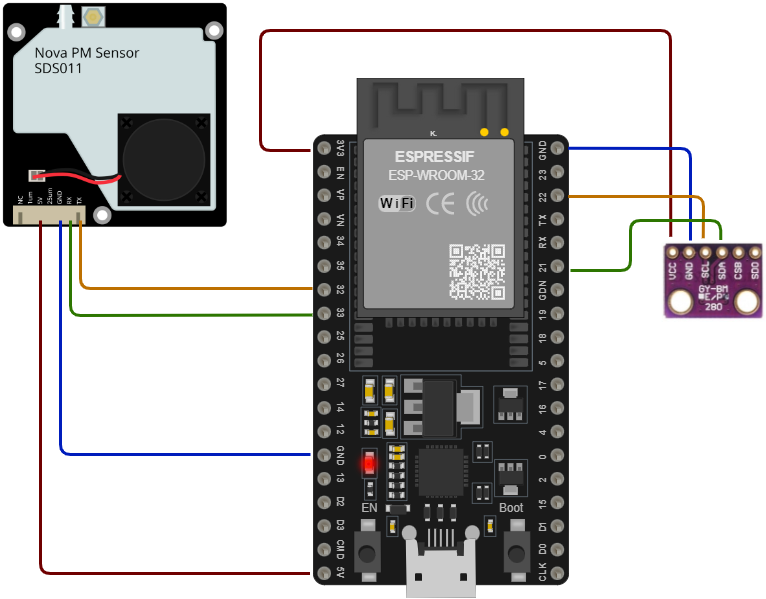

# Air Quality Monitor

This project is using ESP32-WROOM-E3 development board with two sensors - Nova PM SDS011 and Bosh BME280 to monitor air quality and meterological conditions. All data are sent to Azure IoT hub as telemetry data. Properties of the device itself can be inspected via Azure Digital Twin.

## Needed hardware

1. ESP32-WROOM-E3 development board
2. Nova PM SDS011 dust particles sensor
3. Bosh BME280 temperature / humidity / pressure sensor

## Wiring diagram



## Prerequisites

In order to run this project you will have to add **.secrets.cs** file with following content:

```c#

namespace AirQuality
{
    /// <summary>
    /// Project secrets, must be ignored from repo
    /// </summary>
    internal static class Secrets
    {
        /// <summary>
        /// WiFi name
        /// </summary>
        internal const string WiFiSsid = "Your_WiFi_SSID";

        /// <summary>
        /// WiFi password
        /// </summary>
        internal const string WiFiPassword = "Your_WiFi_Password";

        /// <summary>
        /// Azure IoT hub device id
        /// </summary>
        internal const string DeviceID = "Your_Azure_Device_Id";

        /// <summary>
        /// Azure IoT broker address
        /// </summary>
        internal const string IotBrokerAddress = "Your_Azure_Broker";

        /// <summary>
        /// Azure IoT hub shared secret key
        /// </summary>
        internal const string SasKey = "Your_Azure_Shared_Key";
    }
}

```
