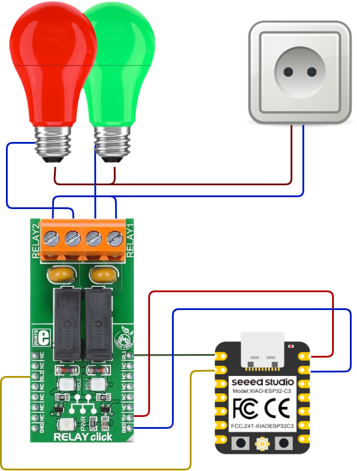

# Light Remote Control

This project is using Xiao ESP32C3 development board with two relays to control two light bulbs. Lights are controlled via rest API hosted on Xiao MCU.

## Needed hardware

1. Xiao ESP32Ce development board
2. Relay Click MIKROE-1370 dual relay Click board
3. Two light bulbs with sockets
4. Plug with cable
5. 4 WAGO 221 Connecting terminal with spring-loaded clamp

## Wiring diagram



## API Endpoints

Control two relays via rest API

### Check Service

Checks if service is healthy
(GET)
https://control.conf.internal/health

### Check relay

Gets the state of both relays
(GET)
https://control.conf.internal/relays

### Relay ON

Turns on the **n**-th relay
(PUT)
https://control.conf.internal/relay/on

Body (urlencoded)
n = 1

### Relay OFF

Turns off the **n**-th relay
(PUT)
https://control.conf.internal/relay/off

Body (urlencoded)
n = 1

## Prerequisites

In order to run this project you will have to add **.secrets.cs** file with following content:

```c#

namespace AirQuality
{
    /// <summary>
    /// Project secrets, must be ignored from repo
    /// </summary>
    internal static class Secrets
    {
        /// <summary>
        /// WiFi name
        /// </summary>
        internal const string WiFiSsid = "Your_WiFi_SSID";

        /// <summary>
        /// WiFi password
        /// </summary>
        internal const string WiFiPassword = "Your_WiFi_Password";

        /// <summary>
        /// Server TLS Certifivate
        /// </summary>
        internal const string ServerCertificate = "Your_Server_Certificate";

        /// <summary>
        /// Server TLS Private Key
        /// </summary>
        internal const string ServerPrivateKey = "Your_Server_Certifcate_Private_Key";

        /// <summary>
        /// Server TLS Private Key Password
        /// </summary>
        internal const string KeyPassword = "Your_Server_Password";
    }
}

```
